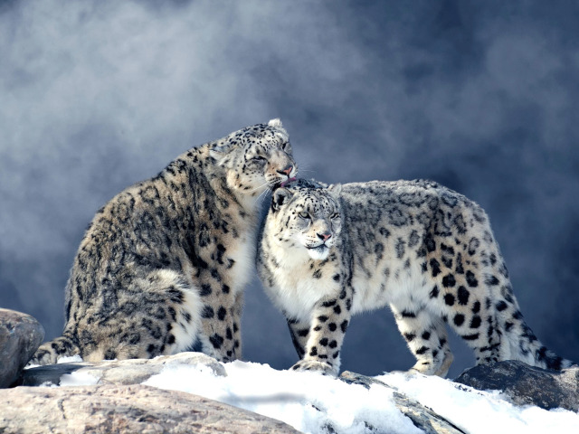
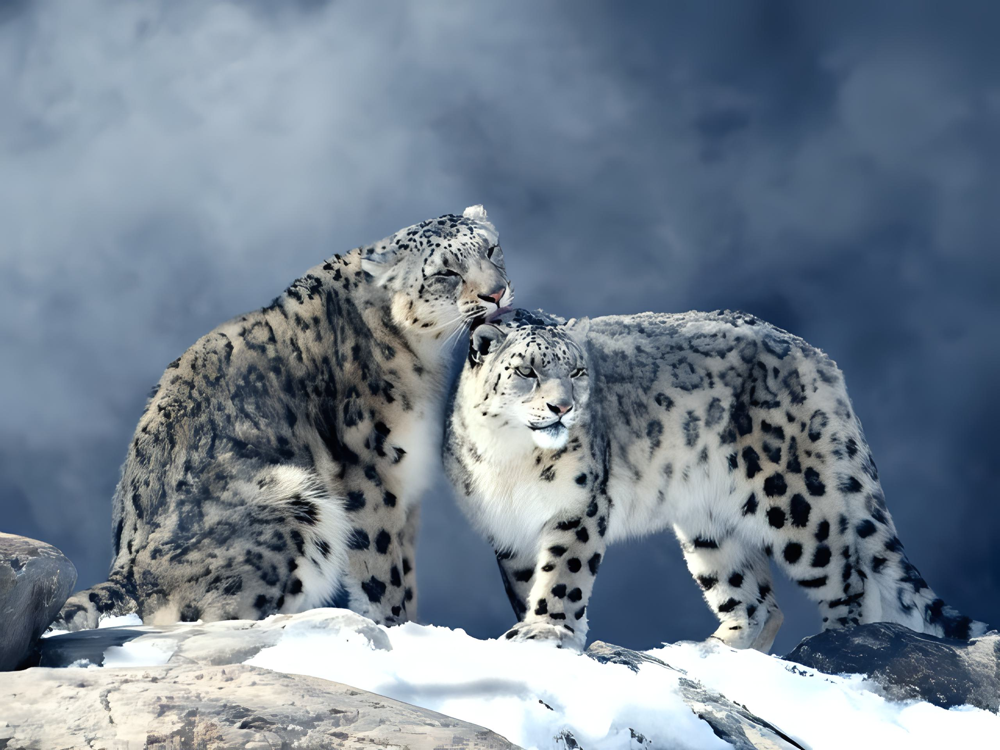

# Real-ESRGAN-Bot

Реализация телеграм-бота, осуществляющего увеличение разрешения входного изображения. В основе данного бота лежит модель нейронной сети под названием Real-ESRGAN -- подход к решению задачи Single Image Super 
Resolution, основанный на генеративно-состязательных сетях. Real-ESRGAN способен улучшать детали и удалять артефакты на изображениях. Модель позаимствована [из этого репозитория](https://github.com/ai-forever/Real-ESRGAN), который не является оригинальной реализацией, и немного адаптирована. 

- Статья: [Real-ESRGAN: Training Real-World Blind Super-Resolution with Pure Synthetic Data](https://arxiv.org/abs/2107.10833)
- [Оригинальная реализация](https://github.com/xinntao/Real-ESRGAN)

### Установка

1. Клонируем репозиторий
   ```bash
   git clone https://github.com/VovaFrolow/Real-ESRGAN-Bot.git
   cd Real-ESRGAN-Bot
   ```

2. Необходимо создать файл "token.txt" и скопировать в него API-токен, который нужно получить у BotFather. Для этого нужно:

   - в поисковой строке приложения телеграм ввести BotFather;
   - прописать "/start" для получения доступных команд;
   - затем ввести команду "/newbot";
   - придумать имя боту (например, Real_ESRGAN_tg_bot);
   - в ответе бота сгенерируется токен, который нужно переадть в файл "token.txt".
   
   Проделать эти манипуляции достаточно только один раз.
3. Запускаем Docker и создаём образ на основе Dockerfile

   ```bash
   docker build -t esrgan .
   ```
   
4. Запускаем контейнер

   ```bash
   docker run -it --rm esrgan
   ```

5. Пишем боту "/start", выбираем коэффициент увеличения разрешения (по стандарту коэффициент х2), отправляем боту изображение и ждём, пока он сгенерирует ответ. В связке с докером бот работает заметно медленнее,
   чем при обычном запуске.

# Примеры работы бота

---

Исходное изображение


Результат применения Real-ESRGAN


---

Исходное изображение



Результат применения Real-ESRGAN



---

Исходное изображение


Результат применения Real-ESRGAN


